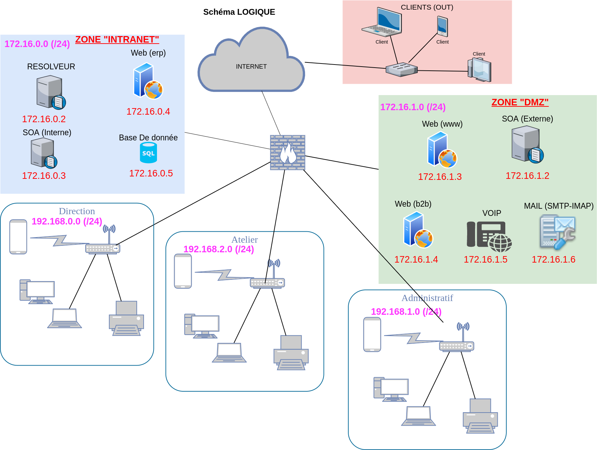
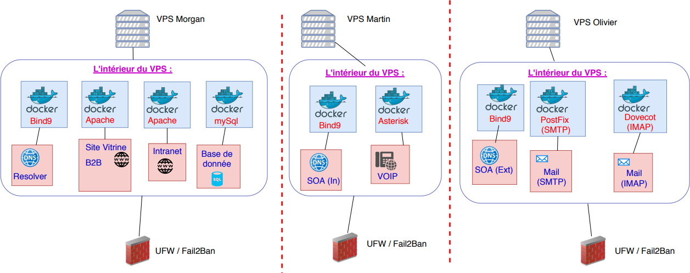

# Projet-SystemAdmin

Projet de Système admin et Réseau de 2eme annee ephec

## Auteurs :

Numéro de groupe: 5

* **Michotte Martin** - [@MMichotte](https://github.com/MMichotte)
* **Valentin Morgan** - [@momo007dev](https://github.com/momo007dev)
* **Olivier Daniel** - [@danny00747](https://github.com/danny00747)

---

## Liens vers les rapports (format PDF) :

* [Rapport Client](https://ephec-my.sharepoint.com/:b:/g/personal/he201682_students_ephec_be/EXYpsOVuqf9MtKv-AgQzQqQBf0Vp1yAwUsJ6mD3MYROXuw?e=BJDVjD)
* [Rapport Technique](https://ephec-my.sharepoint.com/:b:/g/personal/he201682_students_ephec_be/EYhPETmRiVtItbtsRxFSJi4B8s8mfS59E-ym40Ob1SS5EQ?e=5Raazn)
* [Analyse Sécurité](https://ephec-my.sharepoint.com/:b:/g/personal/he201682_students_ephec_be/EdHjMnDHC05JuFfbnsXYeCIBtobD0a1yNcjzYCGf4bvzjw?e=IgNa1w)

---

## Le schéma réseau Woodytoys : 

---
## Le schéma du prototype : 

