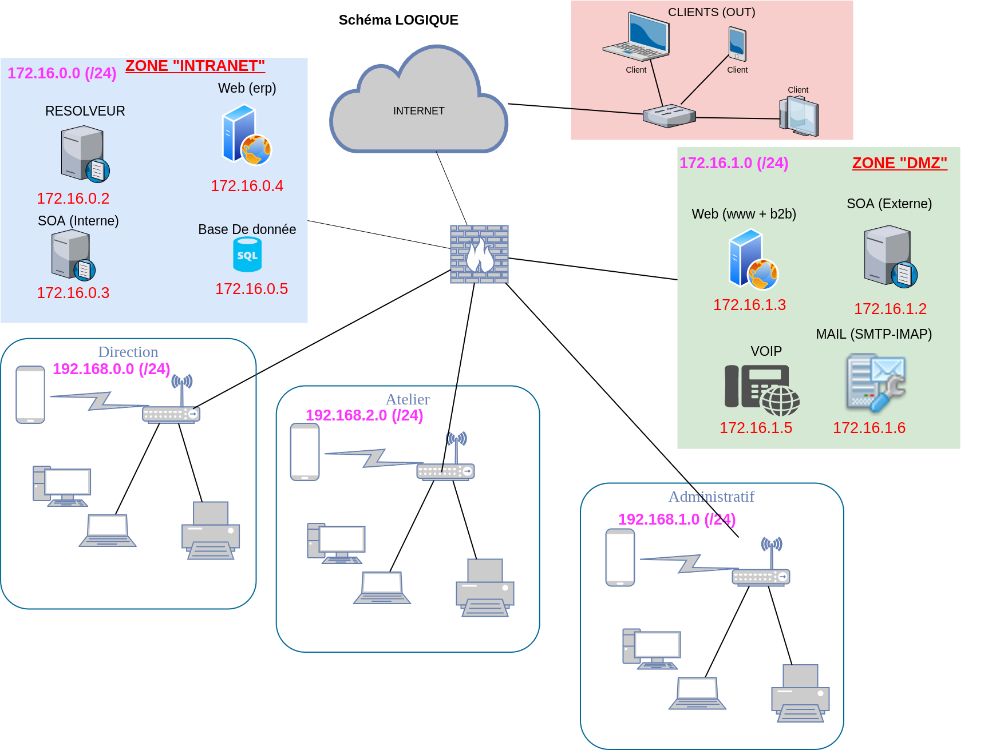

# Projet-SystemAdmin

Projet de Système admin et Réseau de 2eme annee ephec

## Auteurs :

Numéro de groupe: 5

* **Michotte Martin** - [@MMichotte](https://github.com/MMichotte)
* **Valentin Morgan** - [@momo007dev](https://github.com/momo007dev)
* **Olivier Daniel** - [@danny00747](github.com/danny00747)

---

## Liens vers les rapports :

* [Rapport Client](https://docs.google.com/document/d/1bgxRxC8bqTGciTCrO9XSFCFIcBKH7H7bheIUbXf7BRk/edit?usp=sharing)
* [Rapport Technique](https://docs.google.com/document/d/1NFXCPtWWk6QD2MTvEpp9FRYbq5q4lQeFEbI7E9u9ke4/edit?usp=sharing)
* [Rapport Sécurité](https://docs.google.com/document/d/1UEFxSM4gwPkDXTw4UjbRioxRce1wQsP6Psi64nUb6KY/edit?usp=sharing)

---

## Le schéma réseau Woodytoys : 

---
## Le schéma du prototype : 

