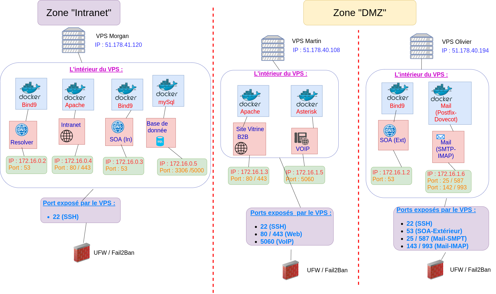

# Projet-SystemAdmin

Projet de Système admin et Réseau de 2eme annee ephec

## Auteurs :

Numéro de groupe: 5

* **Michotte Martin** - [@MMichotte](https://github.com/MMichotte)
* **Valentin Morgan** - [@momo007dev](https://github.com/momo007dev)
* **Olivier Daniel** - [@danny00747](https://github.com/danny00747)

---

## Liens vers les rapports (format PDF) :

* [Rapport Client](https://drive.google.com/file/d/1Oq_D__mkI_DoCI1cRXod56m26uO6qgBS/view?usp=sharing)
* [Rapport Technique](https://drive.google.com/file/d/1AMRbhx1lDwMyRdJK9_C59vQLmSIRjrIc/view?usp=sharing)
* [Analyse Sécurité](https://drive.google.com/file/d/1GoNR7XKXCVj4hD7RUMK0Rknb7dlMP3s2/view?usp=sharing)

---

## Le schéma réseau Woodytoys : 

---
## Le schéma du prototype : 

